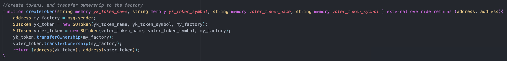
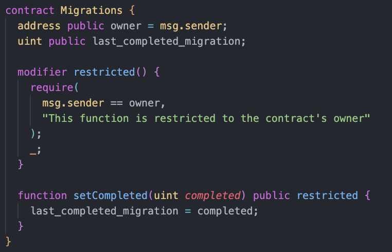
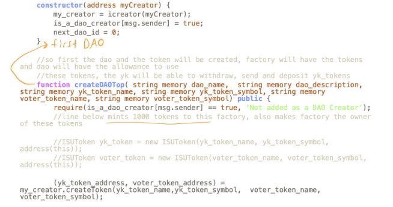
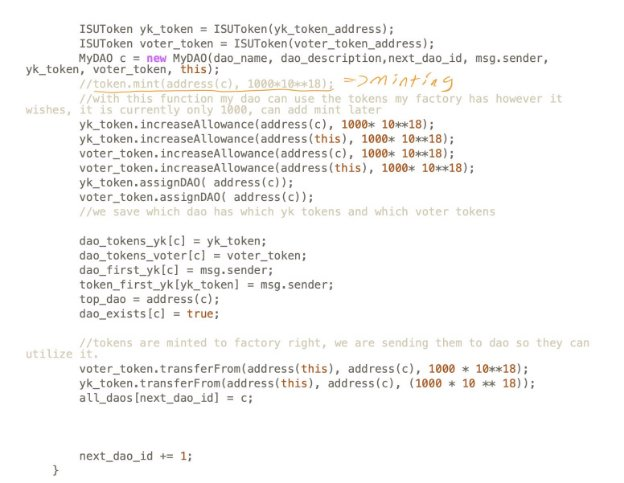
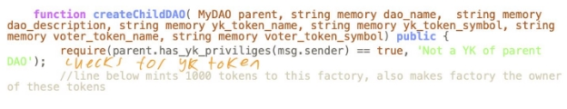
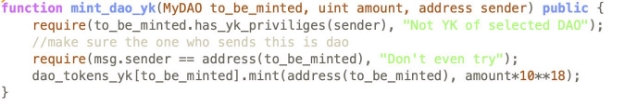
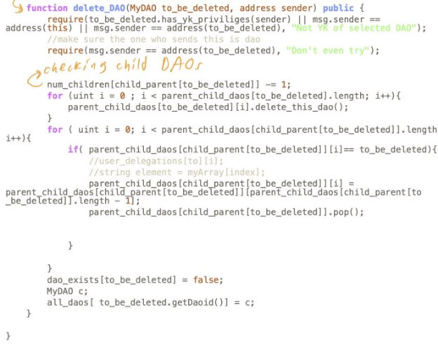
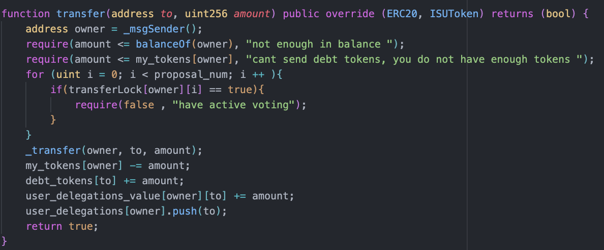
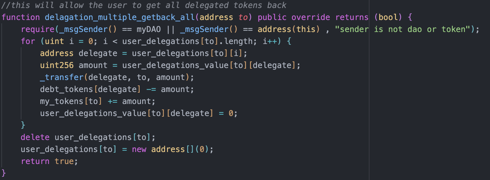

## How to install and run the front-end:

- Download and install node.js\
node.js reference link: https://nodejs.org/en/download/

- Download and install npm or yarn, you need to install npm to download yarn\
yarn reference link: https://classic.yarnpkg.com/lang/en/docs/install/#windows-stable \
npm reference link: https://docs.npmjs.com/downloading-and-installing-node-js-and-npm

- Install the dependency packages\
in the project folder navigate to directory using\
"cd .\contract_for_front_end\ui_sol_deneme2\ui_sol_deneme\sol_ui"\
install the dependencies using "npm install" or "yarn install"\
install next if needed using "npm install next" or "yarn install next"\
Clone the repo from: https://github.com/Cem-Kaya/SU_Govern

- To run the front-end:\
in the project folder change the directory using\
"cd .\contract_for_front_end\ui_sol_deneme2\ui_sol_deneme\sol_ui"\
run the front end using "npm run dev" or "yarn dev"

- Deploying Contracts on TestNet:\
Remix IDE  was used for this.\
Contracts are compiled in this order: 1) token.sol, 2) creator.sol, 3) newDAO1.sol 4) newFactory1.sol.\
Contracts are deployed in this order: 1) creator.sol, 2) newFactory1.sol.\
While deploying newFactory1.sol use the address of creator.sol.

- Connecting to Front End:\
The files that needs modification are found in the directory below.\
“cd .\contract_for_front_end\ui_sol_deneme2\ui_sol_deneme\sol_ui\pages” In dao.js and index.js, the address of daoFactory should be typed in the statement where the daoFactoryContract is defined. In dao.js, line 114, and in index.js, line 180.\
**In addition to this, in order to get YK privileges, the first admin of the Top DAO needs to withdraw 1 YK token from TOP DAO. This can be done through the frontend. This is a one time case during creation. The first contract needs to be deployed using Remix IDE.**

## Contracts

### Creator.sol

This file includes a createToken function which is used to create new tokens and receive their addresses.

'//create tokens, and transfer ownership to the factory
    function createToken(string memory yk_token_name, string memory yk_token_symbol, string memory voter_token_name, string memory voter_token_symbol ) external override returns (address, address){
        address my_factory = msg.sender;
        SUToken yk_token = new SUToken(yk_token_name, yk_token_symbol, my_factory);
        SUToken voter_token = new SUToken(voter_token_name, voter_token_symbol, my_factory);
        yk_token.transferOwnership(my_factory);
        voter_token.transferOwnership(my_factory);
        return (address(yk_token), address(voter_token));
    }'

### Migrations.sol

This file contains the Migrations contract. The contract checks if the migration request is from the owner of the contract and if so completes the task.

### newFactory1.sol

This file contains the DAOFactory contract. This contract creates the Top DAO, which is the DAO that supervises all of it’s sub-DAO’s and mints 100 tokens to this factory.

The below lines show the creation and assignment of the YK tokens to the factory.

The below function is used to create a childDAO under the Top DAO.

The below function is used to mint YK tokens for a DAO.

The below function is used to give creator privileges.

The below function is used to get the address of the parent DAO of a child DAO.

The below function is used to get the address of the current DAO.

The below function is used to delete a DAO. The function checks if the request is sent by a YK member and if so continues with deletion and if not throws an error message. The function also checks if the DAO to be deleted has ant child DAOs and if they exist deletes them as well.

### Token.sol

The below function is used for transfer processes. The function checks the balance of the owner to make sure there are enough credits and gives an option to have a debt if balance is insufficient and modifies the balance amount accordingly.

The below function allows the user to take back all of the delegated tokens.

### Adding an Image to a DAO

The constructor of newdao1.sol file includes an imageurl variable. During the creation of a dao a line like the following can be used to pass the link address of an image to be used for the DAO.

MyDAO myDAO = new MyDAO("https://example.com/image.jpg");
