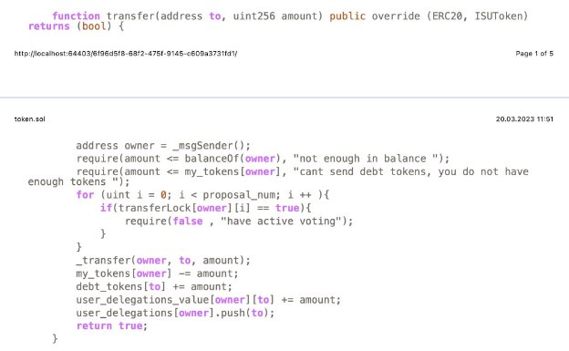
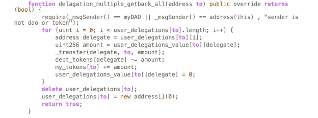

# Contracts

## Creator.sol

This file includes a createToken function which is used to create new tokens and receive their addresses.

## Migrations.sol

This file contains the Migrations contract. The contract checks if the migration request is from the owner of the contract and if so completes the task.

## newFactory1.sol

This file contains the DAOFactory contract. This contract creates the Top DAO, which is the DAO that supervises all of it’s sub-DAO’s and mints 100 tokens to this factory.

The below lines show the creation and assignment of the YK tokens to the factory.

The below function is used to create a childDAO under the Top DAO.

The below function is used to mint YK tokens for a DAO.

The below function is used to give creator privileges.

The below function is used to get the address of the parent DAO of a child DAO.

The below function is used to get the address of the current DAO.

The below function is used to delete a DAO. The function checks if the request is sent by a YK member and if so continues with deletion and if not throws an error message. The function also checks if the DAO to be deleted has ant child DAOs and if they exist deletes them as well.

## Token.sol

The below function is used for transfer processes. The function checks the balance of the owner to make sure there are enough credits and gives an option to have a debt if balance is insufficient and modifies the balance amount accordingly.

The below function allows the user to take back all of the delegated tokens.

## Adding an Image to a DAO

The constructor of newdao1.sol file includes an imageurl variable. During the creation of a dao a line like the following can be used to pass the link address of an image to be used for the DAO.

MyDAO myDAO = new MyDAO("https://example.com/image.jpg");